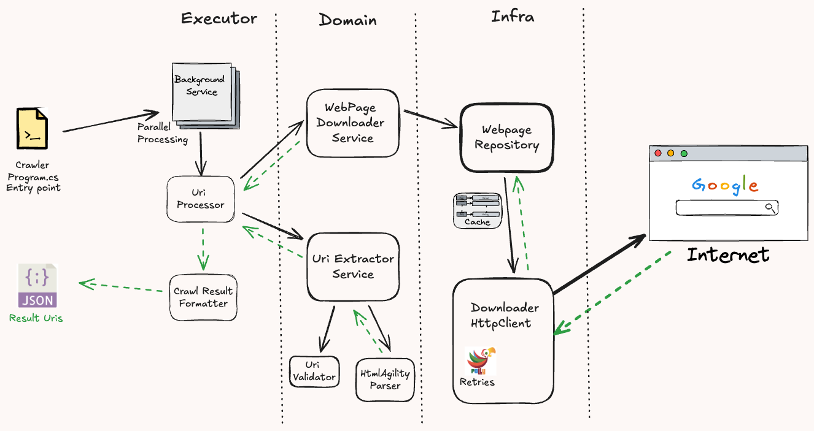

# Simple Web Crawler

A lightweight and efficient web crawler that recursively crawls through a website, retrieves sub-links, and continues to crawl those pages, all while staying within the domain of the parent site.

## Features

- Crawls through websites, gathering sub-links.
- Only crawls links within the parent domain.
- Supports output in various formats such as JSON.
- Can be run locally or within a Docker container.

## Prerequisites

- [.NET SDK 8.0](https://dotnet.microsoft.com/en-us/download/dotnet/8.0)
- Docker Desktop 4.22
- Docker Engine - v24^
- OS: Windows 10 / Linux / Mac

## Usage

### 1. Clone or Download the Repository

You can either download this repository as a zip file or clone it via git.
```bash
git clone https://github.com/dpgithub87/WebCrawler.git
```
### 2. Run the Project Locally

To run the crawler, navigate to the root directory and execute the appropriate command in your terminal.
```bash
dotnet run --project WebCrawler.Executor/WebCrawler.Executor.csproj --url "https://bing.com" --maxdepth 1 --format "json"
```
**Output**: The results will be saved in the `Output` folder located in `WebCrawler/WebCrawler.Executor/Output`.

### 3. Running the Crawler in Docker

To run the crawler within Docker, follow these steps:

1. Build the Docker image.
```bash
docker build -t webcrawler-executor:v1.0 .
```
2. Run the Docker container.
```bash
docker run --name web-crawler-container -it -e ASPNETCORE_ENVIRONMENT=Development webcrawler-executor:v1.0 --url "https://bing.com" --maxdepth 1 --format "json"
```
3. Retrieve the output from the Docker container to your local machine.
```bash
docker cp web-crawler-container:/app/Output .
```
**Docker Arguments Explanation**:

- `-t`: Tag for naming the image.
- `--rm`: Automatically remove the container once it stops.
- `-d`: Run container in detached mode.
- `-it`: Interactive terminal to keep STDIN open.

**Note**: The first run may take some time as Docker downloads the base ASP.NET 8.0 and SDK images. Subsequent runs will be faster due to caching.

## System Design

### Core Components

- This project follows the Clean code architecture where we have following components:
  - Executor (API / Interface layer)
    - **Crawler Executor**: This is the main component responsible for orchestrating the crawling process.
    - **Background Service**: Manages concurrent crawling using parallel tasks.
  - Domain (Core business logic - independent of any I/O operations.
    - **UriExtractor**: Extracts all valid URLs from the HTML content. It uses Html Agility Parser to extract Uris.
  - Infrastructure - Contains the I/O operations - HttpClient
    - **WebDownloader**: Fetches the HTML content of each page.

### Fault Tolerance

- **Polly Library**: Configured with retries (3 times by default) using exponential backoff to handle transient errors.

### Caching

- **Distributed Caching**: Leverage Redis or similar services to cache upstream API responses.
- **Page Depth Limit**: You can impose a limit on the level of depth to crawl in BFS(breadh first search) manner.

### Data structures
- Thread safe data structures are used to store the task details and to store the list of processed Uris in concurrent execution.


## Productionize the Application
### Microservice Architecture

- Extract the WebDownloader and UriExtractor as independent microservices to enhance scalability and efficiency.

### Error Handling

- Enhance error handling at each service layer, with a middleware for unified responses.
- Implement DLQs (Dead Letter Queues) for failed processes during crawling.
  
### Integration

- **Message Queueing**: Communicates between microservices using systems like Azure Service Bus or RabbitMQ.
- **API Communication**: Microservices can communicate via gRPC or REST as an alternative.

### CI/CD Pipeline

Use the `WebCrawler.Executor/Dockerfile` to build Docker images in your CI/CD pipeline. These images can then be pushed to cloud container registries and deployed to Kubernetes clusters (e.g., Azure Kubernetes Service - AKS).

### Deployment & Monitoring

### Kubernetes

The application can be deployed on any Kubernetes cluster (AKS, EKS, etc.).

### Observability Tools

- **Log Collection**: Tools like Datadog or Kibana (elastic-search) can gather logs from the Kubernetes PODs.
- **Metrics & Alerts**: Prometheus and Grafana can monitor the health of PODs and clusters, along with setting up alerts for threshold breaches.
- **Tracing**: Open-telemetry tools like Honeycomb to trace requests across services for in-depth analysis.

### Persistent Storage

- Store crawler state and results in a database for query-based analysis.
- Enable the crawling process to be paused and resumed by storing state.

## Future Improvements

### Optimized Crawling

- Introduce a queuing mechanism (e.g., URL Frontier) to manage the crawling process more efficiently.
- Integrate `robots.txt` for honoring website-specific crawling rules.
- Rate Limiting Rules per Website: Implement rate limiting to avoid overloading the target website and to comply with its usage policies. This can be done using targeted queues with specific rules tied to each website.

### Parallel Processing at Kubernetes layer

- Implement the crawler-executor as a Cron job or as a deployment pod to monitor a queue for new sites, enabling parallel crawling.


### Advanced Content Extraction
- Scraping Specific Content: Implement options to scrape and structure specific data such as titles, meta descriptions, headers, images, and other custom elements based on user-specified selectors or patterns.

### Dynamic Content Handling:
- Use headless browsers like Puppeteer or Selenium to handle and crawl dynamic content generated by JavaScript.

### Improved Result Formatting

- Provide more user-friendly and customizable output formats.
