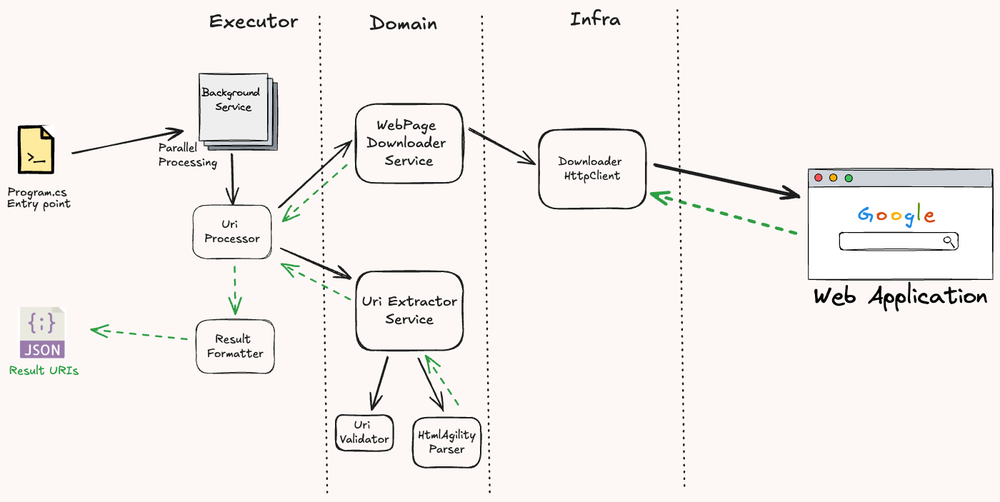

# Simple web site crawler
This is a simple component that will crawl through a website (like https://www.bbc.co.uk/), find sub-links, and then crawl those pages as well. 

# Functionalities
- Only links that fall under the domain of the parent site will be accepted.

# How to run
Got to the project root directory and run the following command:
```shell
dotnet run --project CrawlerExecutor/CrawlerExecutor.csproj
```


# System Design
- Crawler-Executor: This is the main component handles the crawling process.
  - It uses the WebDownloader to download the HTML content of the page.
  - It uses the UriExtractor to extract the links from the HTML content.
  - It uses the background service to parallelize the crawling process.
- Fault tolerance: Polly retries are configured to handle transient errors. The default policy is to retry 3 times with an exponential backoff.

Project Components:


# Future Improvements
- The crawler could be made more efficient by using a queue to manage the links to be crawled.
  - URL Frontier could be used to manage the queue.
  - robots.txt could be used to determine the rules (like the rate of crawling) for each site.
- The WebDownloader/UriExtractor could be deployed as a separate micro service to allow for more efficient crawling of multiple sites.
  - This would allow for the WebDownloader/UriExtractor to be scaled independently of the crawler.
- The crawler-executor itself could be deployed as a separate Cron job that monitors a queue for new sites to crawl.
  - This allows parallel crawling of multiple sites; in addition to the background service that crawls the site.
- Better error handling could be implemented. Each layer of the services could have its own error handling mechanism.
  - This would allow for more detailed error messages to be returned to the user.
  - DLQs could be used to handle errors that occur during the crawling process.
- Results / state could be stored in a database for future reference.
  - This would allow for the results to be queried and analysed.
  - The state of the crawler could be stored in the database to allow for pausing and resuming of the crawling process.
- Results could be formatted in a more user-friendly way.

